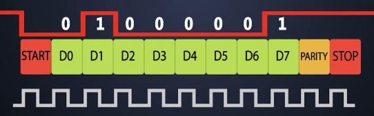
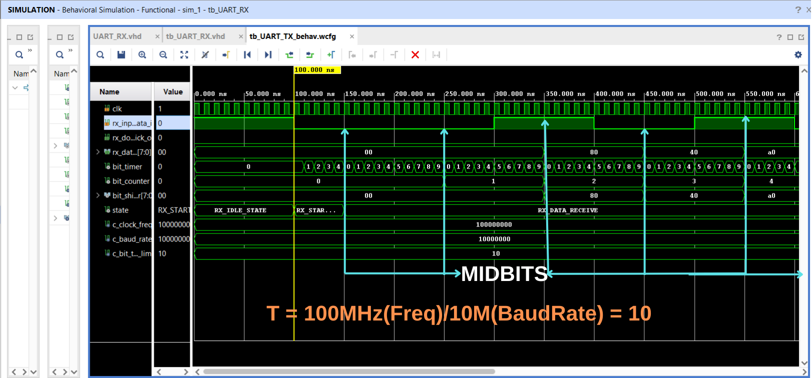

# Custom-UART-Communication-Protocol-Transmitter-RX--with-FPGA-VHDL
Custom-UART-Communication-Protocol-Transmitter-RX--with-FPGA-VHDL  (MID-BIT SAMPLING TECHNIQUE)

Hello, in the previous work, we designed a custom UART TX module, and now we will design a custom UART RX module.
As shown below, the line is in a logical high state (1) when inactive, meaning there is no communication. Initially, when a start bit with a value of 0 arrives, the receiver module detects that communication has started and begins processing the incoming bits using the implemented state machine.

There are several different approaches to designing a UART module. In this project, to keep the design as simple as possible, sampling will only be performed at the midpoint of the received data. This method is referred to as "mid-bit" sampling in the literature. Initially, the start bit will be sampled at half the period, and then the process will continue by adding one full bit period at a time until 8 bits have been received, after which the stop bit will be processed.

Below, you can find some simulation examples, mid-bit sampling, and timing diagrams of the designed UART RX module. To make the simulation results easier to observe, I have initialized the baud rate at 10,000,000 instead of 115,200.
With this setting, when using a 100 MHz clock signal, counting up to 10 will take exactly 1 second, providing a better visualization of the simulation results.
Since the design is custom, the baud rate setting is adjustable, allowing you to choose a different baud rate if desired.

- X"AA"
- X"13"
- X"5B"

